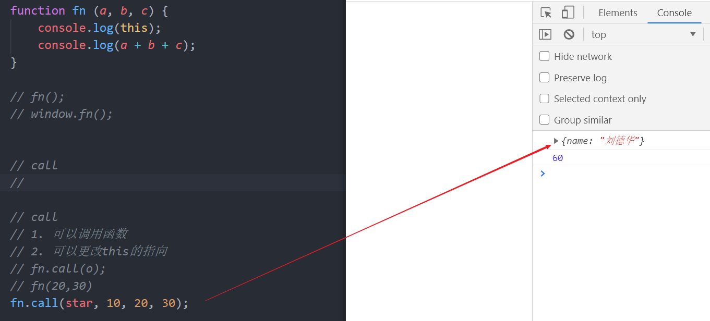
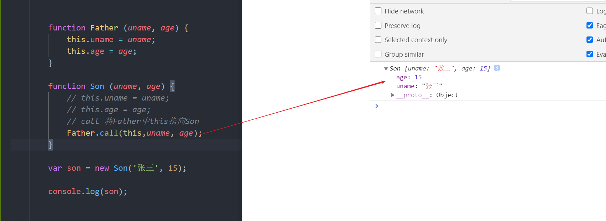

# JavaScript高级

### 1.this指向


```java
this:是一个对象，他的值是不确定的， 根据它的调用者来决定，谁调用的，this就执向谁。
```

### 2.call

```javascript
作用：
1. 调用函数
2. 更改函数体中的this指向


语法：
   函数名.call(对象，实参1，实参2,.....实参n)
```





### 3.apply

```javascript
语法：
 函数名.apply(对象,[参数1，参数2，...参数n])


作用：
    1. 调用函数
    2. 更改this指向
```


### 4.bind

```javascript
1. 语法
函数名.bind(对象)

2. 作用
2.1 更改this指向


3. 特点
3.1 不会调用函数
3.2 返回一个修改this指向后的新函数

应用场景:
       1. 想修改函数中的this指向，而且不需要立刻调用函数的时候，使用bind
```


### 5.开启严格模式

```javascript
1.消除了 Javascript 语法的一些不合理、不严谨之处，减少了一些怪异行为。

2.消除代码运行的一些不安全之处，保证代码运行的安全。

3.提高编译器效率，增加运行速度。

```

.

### 5.1开启严格模式后的变化


### 6.高阶函数

```javascript
1. 高阶函数： 函数的参数是函数或者函数的返回值是函数,只要满足其中一项条件都称为高阶函数
```


 {
          // 公共的属性放在构造函数里面,加到this上
          this.name = name;
          this.age = age;
        //   this.sing = function () {
        //       console.log('会唱歌');
        //   }
      }

    //   console.dir(Star);
    // console.log(Star.prototype);

    // 给Star的原型对象添加方法
    // 公共方法，添加到构造函数的原型对象了
    Star.prototype.sing = function () {
        console.log('会唱歌');
    }

     var  ldh  =  new Star('刘德华', 18);
     var  zxy  =  new Star('张学友', 18);

     console.log(ldh.sing());
     console.log(zxy.sing());

     console.log(ldh.sing == zxy.sing);

    //  console.log(ldh);
    //  console.log(zxy);
```

### 构造函数和原型对象和对象实例三角关系


### 原型链


```javascript
  // 1. 对象实例上面查找属性或者是方法的时候去对象实例上找，找不到就对构造函数的prototype上找
// 2. 如果构造函数的prototype上找不到，由于Star.prototype.__proto__ 指向Object.prototype， 到Object的prototype上找
// 3. 如果Object的prototype上找不到，由于Star.prototype.__proto__ 指向null, 真没有了
```

```javascript
// 1. 创建构造函数
            function Star (uname, age) {
                this.uname = uname;
                this.age = age;
                // this.money = function () {
                //     console.log(200);
                // }
            }


            Star.prototype.money = function () {
                console.log(10000000000,'构造函数Star的prototype');
            }

            Star.prototype.uname = '李四';

            Object.prototype.uname = '王五';

            Object.prototype.money = function () {
                console.log(100000000000000000,'Object.prototype');
            }

  // 2.根据构造函数创建实例对象
            var zs = new Star('张三', 18);
// console.log(zs.money());

            // console.log(zs.__proto__);
            // console.log(Star.prototype.__proto__);

            // console.log(zs.uname);
            // console.log(zs.money());
            // console.log(zs.money());
            console.log(Object.prototype.__proto__);

```

### 构造函数里面的this


### 拓展数组内置方法

```javascript
给内置构造函数Array的原型添加方法，只要是数组就能够使用你新增的方法
Array.prototype.sum = function () {
            console.log(this);
            var sum = 0;
            for (var i = 0; i <this.length; i++ ) {
                sum += this[i];
            }
            return sum;
        }

    var arr1 = new Array(20,10,20,40);
    console.log(arr1);
```

### 构造函数和原型实现继承

。

#### 剩余运算符

```javascript
在函数的形参(...变量) 

作用：
     1. 简化arguments
     2. 数组的形式存放所有的实参，可以使用数组中的方法
```

### 拓展运算符

```javascript
语法： [...数组]

作用： 
1. 合并数组
2. 把伪数组转换成数组，可以使用数组中方法

//  // 数组合并
		//  var arr1 = [10,20];
		//  var arr2 = [20, 40];
		//  //...展开数组中每一项数据
		//  var newArr = [...arr1, ...arr2];
		//  console.log(newArr);

		var divs = document.querySelectorAll('div');

		//  divs = divs.push('张三');

		var r = [...divs];

	   r.push('李四');

		console.log(r);
```

### Array.from

```javascript
语法： 
Array.from(伪数组)

作用：
1.将伪数组转换成数组, 可以使用数组中的方法
2.参数2是函数，可以修改原数据

	 // 1.对象字面量创建对象
		 var obj = {
			 0:'张三',
			 1: '李四',
			 2: '王五',
			 3: '轩腾',
			 length: 4
		 };

		//  obj.push(100);
		 
		//  console.log(obj);
		// var r = Array.from(obj);
		var r = Array.from(obj, item => item + '*' );
		// r.push(1000);

		console.log(r);


		//  console.log(obj);

		//  for (var i = 0; i <obj.length; i++ ) {
		// 	 console.log(obj[i]);
		//  }
```

### find方法

```javascript
语法；
    数组名.find(回调函数)

作用：
   根据条件筛选数据
   
   	// 1.字面量初始化数组
		var arr = [
			{ name: '张三', age: 17, score: 90 },
			{ name: '李四', age: 18, score: 85 },
			{ name: '王五', age: 20, score: 100 },
			{ name: '赵六', age: 19, score: 95 },
			{ name: '轩腾', age: 18, score: 100 },
		];


		// 2.查找数组中每一项，成绩为100的学生
		var result = arr.find(function (item) { return item.score == 100 });

		console.log(result);
```

### findIndex

```javascript
语法：
   数组.findIndex(回调函数)
作用：
	筛选数组中满足条件的数据在数组中下标

	// 1.字面量初始化数组
		var arr = [
			{ name: '张三', age: 17, score: 90 },
			{ name: '李四', age: 18, score: 85 },
			{ name: '王五', age: 20, score: 100 },
			{ name: '赵六', age: 19, score: 95 },
			{ name: '轩腾', age: 18, score: 100 },
			{ name: '赵六', age: 19, score: 95 }
		];


		// var index;

		// for (var i = 0; i < arr.length; i++) {
		// 	if (arr[i].score == 95) {
		// 		index = i;
		// 	}
		// }

		// console.log(index);

		// 2.查找数组中每一项，成绩为95的学生
		// var r = arr.findIndex(function (item) {  return item.score == 95 });
		var r = arr.findIndex( item => item.score == 95 );

		console.log(r);

```

### includes方法介绍

```javascript
语法：
  数组.includes('数据')
  字符串.includes('数据')
返回值： 布尔值  true  false

作用： 1. 查找数组中是否包含某项数据(NaN)
```

### startsWith方法和endsWith方法

```javascript
语法：
  字符串.startsWith('数据')
  字符串.endsWith('数据')


作用： 
   1.查找字符串中是否以...开始，或者以...结束

返回值： 布尔类型  

var str = 'hello world';
console.log(str.startsWith('h'));
console.log(str.endsWith('rld'));
```

### repeat

```javascript
语法：
字符串.repeat(n)

作用： 
    将字符串重复指定n次,返回一个新字符串

  var str = '张三';
​       console.log(str.repeat(10));

```

### set

```javascript
语法：
    var set = new Set(数组)
    
作用： 
    1. 数组去重(基本数据类型)

size: 获取长度
	//  var arr = [10,20,30,40,50,60,20,30,40,50,60];
		//  var arr = ['张三', '张三', 100, 100];
		 var arr = [{name:'张三'}, {name:'张三'}];

		 // 实现数组去重
		//  var newArr = new Set(arr);
		//  var newArr = new Set([10,20,20,20]);
		//  var newArr = new Set(10,20,20,20);
		// 1. 只会真基本数据表类型进行去重  number bool string null undefined
		var set = new Set(arr);
		console.log(set);
		 console.log(set.size);


四个api方法
.add(数据)添加
.delete(数据) 删除数据
.has(数据) 是否存在当前数据， true 存才   false 不存在
.clear() 清空所有数据
	var set = new Set();

		// 增加数据
		set.add(100)
		   .add('李四')
		   .add({age: 17});


		// 删除数据
		set.delete('李四');

		// 是否包含
		console.log(set.has(100));

		// 清除所有数据
		set.clear();

		console.log(set.size);
		console.log(set);


set转成数组
1. [...set]
2. Array.from()
var r = [...set];
var r = Array.from(set);

```

### 浅拷贝

```javascript
定义：
    将引用类型的引用(指针)拷贝给新对象
    
注意：
    由于拷贝的是同一个指针，指针指向堆内存中同一块空间,所以修改数据时，会相互影响

   var o = {
             name:'张三'
         };

   var obj = o;

   obj.name = '李四';

   console.log(o);
```

### 深拷贝

```javascript
定义：
    将引用类型各项属性的值拷贝给新对象
    
    
实现深拷贝
 方式1： 手动复制
 
 方式2： Object.assign()  只能实现一层的深拷贝，不能实现更深的一层拷贝
 
 
 Object.assign(目标对象， 待拷贝的对象1,待拷贝的对象2,待拷贝的对象3,待拷贝的对象n)

 注意： 重复的属性，后面会覆盖前面的属性
   
        var o = {
             name:'张三',
             info: {
                 age: 17
             }

         };

        //  // 手动复制实现深拷贝
        //  var obj = {name: o.name}

        //  obj.name = '李四';

        //  console.log(o);

        var r = {};
        // 给对象添加属性和对应的值
        Object.assign(r, o);
        // r.name = '李四'

        r.info.age = 30;

        console.log(o);
 
```

### JSON.stringify() 和JSON.parse()

```javascript
  var o = {
            name: '张三',
            info: {
                age: 17
            }
        };

       // 一劳永逸
       var r  = JSON.parse(JSON.stringify(o));

    //    r.name = '李四';
    r.info.age = 20;

       console.log(o);
```

